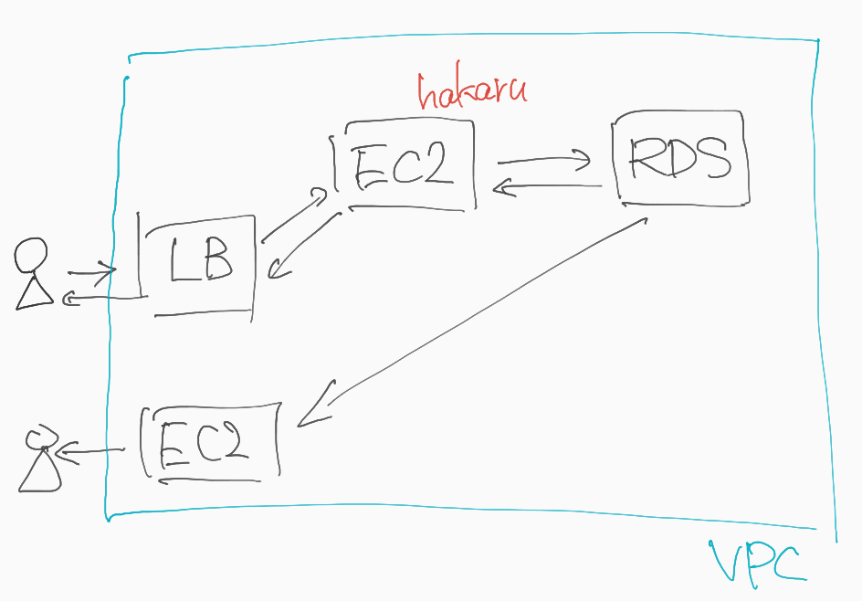

# Sunrise

* パフォーマンス改善の現場を体験しよう
* 競争ではないよ

## 流れ

1. 説明
1. セットアップ
1. パフォーマンスを確認する
1. もっとパフォーマンスを改善する
1. もっともっとパフォーマンスを改善する

# お題

* イベント計測サービスを強くしよう

## イベント計測サービス

なにかしらのイベントを収集するサービス

### 計測サービスの例

* Google アナリティクス
    * WEBサイトの訪問者を細かく計測できる
    * https://www.google.com/analytics/web/?hl=ja
* スシロー
    * レーンを流れる寿司の鮮度や来店状況から、次に作る寿司の最適化を行ってる
    * https://aws.amazon.com/jp/solutions/case-studies/akindo-sushiro/
* IOT関連ではよくある
    * 畑やビニールハウスの環境情報の収集
    * 衣服管理
    * POSレジも似たようなもの

### hakaru

広告システムでよくある、インプレッション計測システム

* インプレッション: 広告が見られた回数のこと

例: fluct

TODO: ブラウザで確認する

#### システム概要

* ロードバランサー
    * HTTPリクエストを受けてインスタンスに振り分ける
* インスタンス
    * HTTPリクエストを受けてレスポンスを返す
    * インプレッションを記録するGoアプリケーション
* データベース
    * アプリケーションからインプレッションのデータが登録される
    * リレーショナルデータベース(MySQL)
* レポート画面
    * どれだけインプレッションが発生したか確認できる
    * 今回は簡単のためにredashというツールでSQLを発行して確認する

## なぜパフォーマンス改善をするのか

* ユーザ体験の向上
    * さっさと表示されて欲しい
        * 一般的に、3秒以下でページが表示されることを期待されている
        * なおのこと、広告はその邪魔をしてはいけない
* サービスの継続
    * Google ページ反応が0.5秒遅くなるとアクセス数は20%低下する
    * Amazon ページ表示速度が0.1秒遅くなると売上が1%低下する
    * 単位時間あたりに表示できるリクエスト数という性能を上げることはコストを減らすことに繋がる(リソースが同一の場合)

(質問タイム)

## ここからの流れ

1. ~~説明~~
1. セットアップ
1. パフォーマンスを確認する
1. もっとパフォーマンスを改善する
1. もっともっとパフォーマンスを改善する

# セットアップ

* チーム確認
* チーム毎にAWSアカウントを配ります
    * 人々にはIAMユーザを配ります
    * サポーターがいい感じにしてくれます
* あらためて構成について一つ一つみていく
* アプリのデプロイ方法について
    * AMI作成の実演

## まず動かしてみよう

* AMIからインスタンスを起動する
* ロードバランサーの作成
    * ターゲットグループの作成
    * インスタンスをターゲットグループに登録する
    * 試しにcurlでリクエストを送ってみる

# kakeru

リクエストを大量に作って送信してくれる負荷試験ツール

* tsungというツールを使っている
* 試しにリクエストを送ってみよう
    * 実演

(質問タイム)

# さあ、パフォーマンス改善だ！

その前に

## パフォーマンス対策の現場から

* 仮説を立てて実験し、結果を見る

[最適化](https://ja.wikipedia.org/wiki/%E6%9C%80%E9%81%A9%E5%8C%96_(%E6%83%85%E5%A0%B1%E5%B7%A5%E5%AD%A6)
> あらゆる場合に最適な方法や設計は存在しないので、技術者は最も重要と思われる観点での最適化のために妥協点を探る。さらに、ソフトウェアを完全に最適にする（それ以上どうやっても最適化できない状態にする）のに要する労力は、その最適化されたシステムを利用することで得られる利益よりも大きい。従って、最適化の工程は完全な最適解に到達する以前に終了させられるのが普通である。幸いなことに、効果の大きい改善は最適化工程の初期に現れることが多い。

* 必要なだけ改善すれば良くて、頑張りすぎない
* `必要なだけ` って？

## 信頼性の定義

* SLA
    * サービつ品質保証。サービスを顧客に提供する際の契約
    * よく使われるのは、ダウンタイムの年間上限。99.999%で年間5分しか止めちゃダメ
* SLO
    * サービス品質目標。許容された 停止時間/停止頻度/回復までの時間
        * 失敗間隔の平均時間(MTBF) や 失敗からの回復の平均時間(MTTR) を
        * エラーバジェット(予算) の内に抑えること
    * どの程度のダウンタイムであれば許容されるのかがわからなければ、問題が重大かどうかわからないし、ユーザの期待値もコントロールできない
        * 必要とされるだけ可用性が高くなるようにシステムを設計せよ。ただし、それ以上のシステムは必要ない

https://cloud.google.com/blog/ja/products/gcp/availability-part-deux-cre-life-lessons

## 目標レベル

**今回は、30000RPSクリアを目指して、成功率 99.90% を意識しよう**

## 注意点

* スケールアップは禁止(インスタンス自体の性能アップ)
    * hakaruのEC2やRDSが対象
    * 実は簡単に性能は上がる
    * しかし、限界はすぐにやってくる
* コストについては、あんまり考えない

(質問タイム)

# 進め方

仮説を立てて、実験して、結果を考える

## 観測、仮説、実験

Observability（可観測性）とは:

> 「モニタリング」「スマートなアラート、ダッシュボード」「分散環境上でのトレーサビリティ、障害検知」「ログ収集、分析」といった、オペレーションに必要なすべての要素の上位概念として最近では位置付けられている
>  https://yoshidashingo.hatenablog.com/entry/serverlessconfparis18

* ツール
  * [CloudWatch Metrics](https://ap-northeast-1.console.aws.amazon.com/cloudwatch/home?region=ap-northeast-1#metricsV2:)
  * [CloudWatch Logs](https://ap-northeast-1.console.aws.amazon.com/cloudwatch/home?region=ap-northeast-1#logs:)
  * Redash
  * Tsung report
* SLIの各値は、どこで観測できるか？
  * 単位時間あたり処理数は？
  * 成功率は？
* SLを下げている原因は、どこで観測できるか？
  * エラーログ？
  * もしくは、どこに観測ポイントを足すといいか？

## 流れ

* アイデア・改善案を出す
    * うまくいきそうなことを考える
* 優先度を考える
    * できそうなことを探す
* 決める
    * 担当者を決めよう、4人全員でやるか、2人ずつペアでやるか、etc
    * ペースを掴むまではポモドーロスタイルがおすすめ
    * 要因分析が難しくなるので、ひとつのデプロイと検証に対して複数のアイデアを盛り込まない
* やる
    * 何をやったか、何を見たか、メモしよう
* 時間がきたら
  * 一旦落ち着く
* レポートを書く
    * うまくできたこと
        * `例: わからないところはサポーターに質問できた`
    * うまくいかなかったこと
        * `例: Go の事がよく分からず、コーディングに時間がかかった`
    * 次はどうすればうまくいきそうか
        * `例: よく分かっている人とペアプログラミングしてみる`
* レポートテンプレートを元に全体共有(1 ~ 2 分)

以上を2時間のセッションとして繰り返す

## まずは、1周目をやってみよう

* アイデア == hakaru サーバをスケールアウトしてみる
  * autoscaling groupをつくってみよう
  * インスタンスを増やしてみよう
  * 負荷をかけてみよう

(質問タイム)

# チャレンジ

もし余裕があったら、考えてみると良いかも

## モニタリング改善

* メトリクス
    * 重要な指標は何か
* ログ
    * どんなログがどれだけ出てるのか
* プロファイル
    * runtime/pprof や net/http/pprof でコードのパフォーマンスを見る

## 目標の追加

* 安定稼働
    * リクエストを受けてる最中にデプロイすると...？
    * ダウンタイムの計測
* レポート反映時間
    * どのぐらいで計測結果をレポートできるか
    * 計測結果が見れないのに計測したといえるか？

---

# 終わりに

## 考えていること

* 状況は常に変わる
* よく観察する
* 課題を見つけて、それを解く

フルサイクルデベロッパー https://techlog.voyagegroup.com/entry/2019/02/04/171325
* 実験と学習、適応の連続

# next オススメ

* AWS GameDay https://aws.amazon.com/jp/gameday/
    * AWS上の実際の環境でDevOpsを実践するワークショップ
* AWSでSNSを構築するワークショップ https://amplify-sns.workshop.aws
* 東京大学2020年度講義一部 AWSによるクラウド入門 https://tomomano.gitlab.io/intro-aws/
* 本の紹介
    * AWSをはじめよう
        * 今回の復習に最適
    * AWSソリューションアーキテクトアソシエイト
        * よりAWSを知りたいなら

